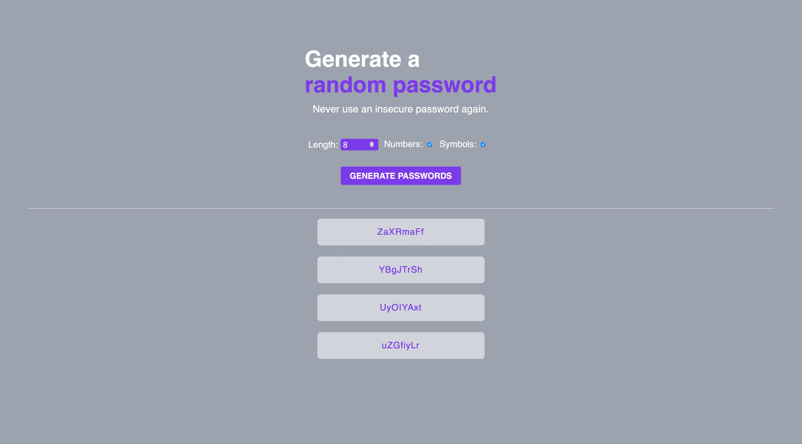
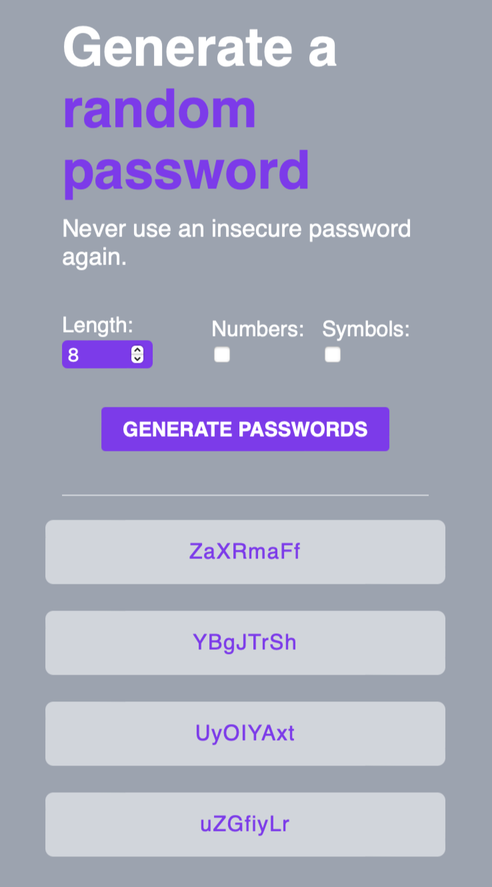

# Random Password Generator

This is a solution to the Scrimba's Random Password Generator solo project.

## Table of contents

- [Overview](#overview)
  - [The challenge](#the-challenge)
  - [Screenshot](#screenshot)
  - [Link](#link)
- [My process](#my-process)
  - [Built with](#built-with)
- [Author](#author)

## Overview

### The challenge

Users are able to:

- Set desired password length
- Add number characters to password
- Add Special characters to password
- Click on generate passwords to generate new passwords
- See four different passwords displayed

### Screenshot

### Link

- Live Site URL: [Vercel](https://random-password-generator-nesdevs.vercel.app)

## My process

### Built with

- Semantic HTML5 markup
- CSS custom properties
- Flexbox
- JavaScript

## Author

- Twitter - [@OfficialNesDevs](https://twitter.com/OfficialNesDevs)
